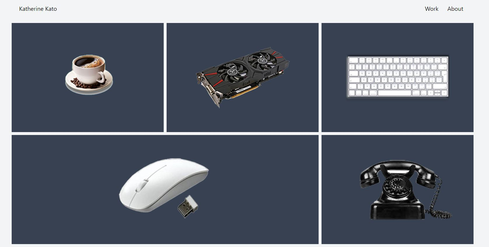

# Gallery using Tailwind css
This is a Gallery created using Tailwind css. This is a simple example of the usage of grid layout.

[**click here to view the component**](https://harishkumaaran.github.io/Gallerytailwind/)
&nbsp;

# screenshots 

&nbsp;

# Technology Stack
- HTML
- CSS
- Tailwind CSS

&nbsp;

# Credits
- This Gallery is done as a part of my Front end curriculum at Aekam Labs, Coimbatore.

